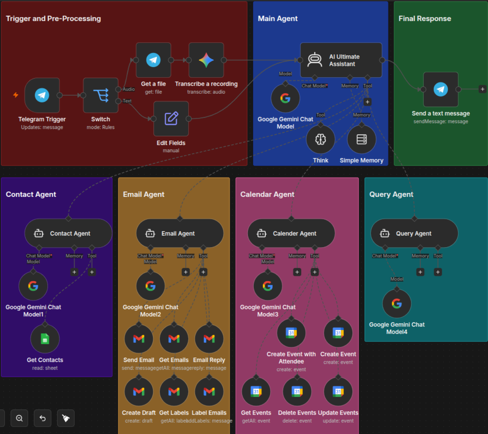
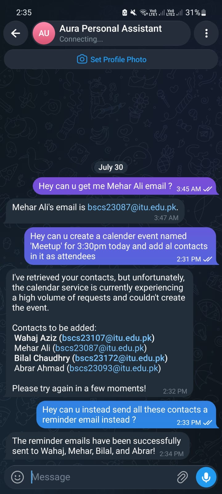

# AI Personal Assistant Agent

An AI-powered personal assistant automation workflow built with n8n, Telegram, Google Gemini, and Groq. The agent allows users to interact through text or voice messages and delegates tasks to specialized AI sub-agents.

## Overview

This project creates a multi-agent personal assistant that can understand user requests, maintain conversation memory, and perform productivity tasks through connected services.

The workflow is triggered through Telegram and uses AI agents for handling different categories of requests.

## Features

- Telegram-based chat interface
- Text and voice message support
- Voice transcription using Google Gemini
- AI reasoning and response generation
- Multi-agent architecture
- Conversation memory support
- Email management
- Calendar management
- Contact management
- General question answering

## Agent Architecture

### Main Assistant Agent

The main AI agent acts as an orchestrator. It analyzes user requests and routes them to the correct specialized agent.

### Contact Agent

Handles contact-related operations:

- Retrieve contact information
- Add new contacts
- Update existing contacts

### Email Agent

Handles email operations:

- Read emails
- Send emails
- Reply to emails
- Create drafts
- Manage labels

### Calendar Agent

Handles scheduling tasks:

- Create events
- Create events with attendees
- Retrieve events
- Update events
- Delete events

### Query Agent

Handles general knowledge queries and generates direct answers.

## Workflow

1. User sends a text or voice message through Telegram.
2. The workflow detects whether the input is text or audio.
3. Voice messages are transcribed into text.
4. The main AI assistant analyzes the request.
5. The request is routed to the required sub-agent.
6. The agent performs the requested action.
7. The response is sent back through Telegram.

## Tech Stack

- n8n
- Google Gemini
- Groq LLM
- Telegram Bot API
- Gmail API
- Google Calendar API
- Google Sheets
- LangChain Agents

## Setup

1. Import the workflow JSON into n8n.
2. Configure your own credentials:
   - Telegram Bot
   - Google Gemini API
   - Groq API
   - Gmail OAuth
   - Google Calendar OAuth
   - Google Sheets OAuth

3. Replace placeholder values with your own configuration.
4. Activate the workflow.
5. Start interacting with your Telegram assistant.

## Screenshots

Add your workflow screenshot:

Add your usage screenshot:

## Notes

The uploaded workflow has been sanitized by removing personal credential identifiers, account references, IDs, and private configuration values. Users must connect their own services before running the workflow.
